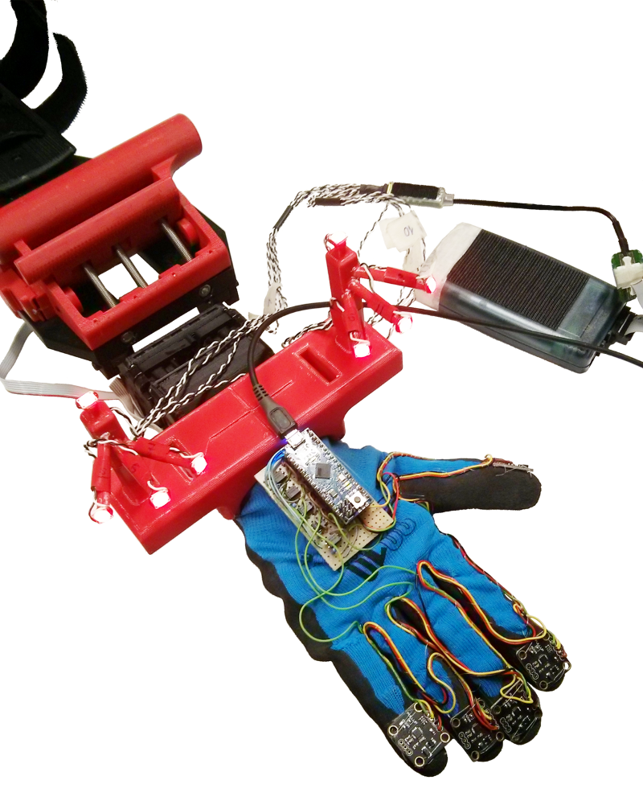

# Glove and PhaseSpace Acquisition Package
This package provides two ROS nodes to collect data from both the *5 IMUs Glove* and the *PhaseSpace Motion Capture System* in log files (these systems has to be properly configured and connected). Have a look at *glove_acquisition* and *phasespace_acquisition* packages for more info on how data is published.

The *major_listener* creates only one log file per each type of data for the entire acquisition (i.e. it starts only the *glove_listener* and the *phasespace_listener* together). It has to be started every times in multiple-experiment acquisitions.

The *random_objects_listener* uses a YAML file, stored in the *config* directory, to handle multiple experiments with ease. The configuration file contains all the information about the experiments that has to be performed by the subject and randomly switch between them until the end. It waits for the subject to be ready, asks if the single acquisition has to be repeated or removed and prompts some statistics of the current acquisition. Feel free to modify that file or to create a new one with your settings (just be sure to load it properly in the launch file). 

In this case, log files are stored in a hierarchical fashion: *subject_name/experiment/current_item/current_direction/date_time_and_terminal_name.dat* (directories are automatically created if needed).

The following picture shows a typical hardware configuration for an experiment.

## Usage
This package provides no standalone nodes: both the *major_listener* and the *random_objects_listener* needs to be launched after an instance of the *glove_talker* and the *phasespace_talker* nodes. For this reason it is recommended to use the provided launch file: `roslaunch glove_and_phasespace_acquisition experiment.launch` initializes the publishers and the *random_objects_listener* node with default settings (use ROS params to change them). Feel free to build other launch files that fit your needs. 

## Info and Warnings

- This package contains two submodules: use the `--recursive` flag with the `git clone` command.
- The *Subject* class uses linux-specific commands, e.g. `system("mkdir -p ...")`. 
- This code has been developed for ROS Indigo on ubuntu 14.04. No warranty for other distributions.

## ROS Params
The class provides several parameters which can be set by the user at runtime:

- subject_name
- experiment
- wait_time_next
- start_time
- stop_time
